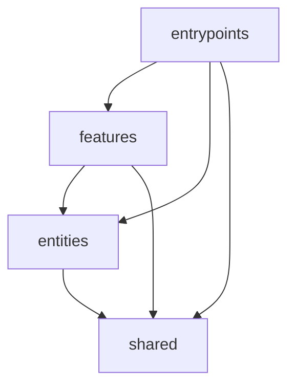

# CTRL Project Organization SOP

> **Gold Standard Architecture for Modern Browser Extensions**

---

## 1. Overview

This document defines the **Single Source of Truth** for CTRL project organization. It follows industry best practices from top-tier open source projects (React, Vue, Vite) adapted for browser extension development.

### Core Principles

| Principle | Description |
|-----------|-------------|
| **Feature-Sliced Design** | Organize by domain, not file type |
| **Unidirectional Dependencies** | Lower layers never import upper layers |
| **Public API Contracts** | Every module exposes via `index.ts` barrel |
| **Context Agnosticism** | Business logic decoupled from browser APIs |
| **Type Safety First** | TypeScript strict mode, no implicit any |

---

## 2. Repository Structure

```
CTRL/
├── .github/                      # GitHub configuration
│   ├── workflows/                # CI/CD pipelines
│   │   ├── ci.yml               # Lint, test, build on PR
│   │   ├── release.yml          # Publish builds
│   │   └── codeql.yml           # Security scanning
│   ├── ISSUE_TEMPLATE/          # Bug/feature templates
│   ├── PULL_REQUEST_TEMPLATE.md
│   └── CODEOWNERS
│
├── docs/                         # Project documentation
│   ├── ARCHITECTURE.md          # High-level system design
│   ├── DEVELOPMENT.md           # Dev setup guide
│   ├── decisions/               # Architecture Decision Records (ADRs)
│   │   └── 001-use-fsd.md
│   └── api/                     # Generated API docs
│
├── extension/                    # WXT Extension (primary package)
│   └── [see Section 3]
│
├── research/                     # Research & specs
│   ├── active/                  # Current research
│   └── archive/                 # Completed research
│
├── .editorconfig                # Editor consistency
├── .gitignore
├── .nvmrc                       # Node version lock
├── LICENSE
├── README.md                    # Project overview
├── CHANGELOG.md                 # Version history
├── CONTRIBUTING.md              # Contribution guide
├── CODE_OF_CONDUCT.md           # Community standards
└── SECURITY.md                  # Security policy
```

---

## 3. Extension Source Structure

```
extension/
├── .output/                     # Build artifacts (gitignored)
├── builds/                      # Production builds
│
├── src/                         # Source code
│   │
│   ├── app/                     # Layer 0: App Configuration
│   │   ├── providers/           # React context providers
│   │   ├── styles/              # Global CSS, Tailwind base
│   │   └── config/              # App-wide configuration
│   │
│   ├── entrypoints/             # Layer 1: Extension Entry Points
│   │   ├── background.ts        # Service worker
│   │   ├── popup/               # Popup UI
│   │   │   ├── index.html
│   │   │   └── main.tsx
│   │   ├── options/             # Options page
│   │   └── content/             # Content scripts
│   │       ├── [site].content.tsx
│   │       └── ...
│   │
│   ├── features/                # Layer 2: Feature Modules
│   │   ├── [feature-name]/
│   │   │   ├── ui/              # React components
│   │   │   ├── model/           # Hooks, state, business logic
│   │   │   ├── api/             # Feature-specific API calls
│   │   │   ├── lib/             # Feature utilities
│   │   │   └── index.ts         # Public API
│   │   └── ...
│   │
│   ├── entities/                # Layer 3: Domain Models
│   │   ├── [entity-name]/
│   │   │   ├── model/           # Types, schemas, validation
│   │   │   ├── ui/              # Entity-specific UI (cards, avatars)
│   │   │   └── index.ts         # Public API
│   │   └── ...
│   │
│   └── shared/                  # Layer 4: Shared Utilities
│       ├── api/                 # API clients, network layer
│       │   ├── clients/         # Torrent client adapters
│       │   ├── network/         # HTTP utilities
│       │   └── security/        # Encryption, vault
│       ├── lib/                 # Utilities, helpers, constants
│       ├── ui/                  # UI component library
│       │   ├── components/      # Button, Input, Card, etc.
│       │   ├── layouts/         # Page layouts
│       │   └── primitives/      # Low-level UI atoms
│       └── hooks/               # Shared React hooks
│
├── tests/                       # Test suites
│   ├── unit/                    # Unit tests
│   ├── integration/             # Integration tests
│   ├── e2e/                     # End-to-end (Playwright)
│   └── fixtures/                # Test data & mocks
│
├── scripts/                     # Build & dev scripts
│
├── public/                      # Static assets
│   ├── _locales/               # i18n messages
│   └── icon/                   # Extension icons
│
├── wxt.config.ts               # WXT configuration
├── tailwind.config.js          # Tailwind CSS
├── tsconfig.json               # TypeScript
├── vitest.config.ts            # Unit test runner
├── playwright.config.ts        # E2E test runner
└── package.json
```

---

## 4. Dependency Rules



| Layer | Can Import From |
|-------|-----------------|
| `entrypoints/` | features, entities, shared |
| `features/` | entities, shared |
| `entities/` | shared only |
| `shared/` | External packages only |

> ⚠️ **NEVER** import upward. Features cannot import from entrypoints. Entities cannot import features.

---

## 5. File Naming Conventions

| Type | Convention | Example |
|------|------------|---------|
| Directories | kebab-case | `torrent-control/` |
| React Components | PascalCase | `ServerCard.tsx` |
| Hooks | camelCase, `use` prefix | `useSettings.ts` |
| Utilities | camelCase | `formatBytes.ts` |
| Types/Interfaces | PascalCase | `ServerConfig.ts` |
| Constants | UPPER_SNAKE_CASE | `DEFAULT_OPTIONS` |
| Test files | `.test.ts` or `.spec.ts` | `useSettings.test.ts` |

---

## 6. Module Structure (Slice Anatomy)

Every feature/entity follows this structure:

```
feature-name/
├── ui/                 # React components (presentation)
│   ├── FeatureCard.tsx
│   └── FeatureForm.tsx
├── model/              # Business logic
│   ├── useFeature.ts   # Primary hook
│   ├── featureStore.ts # Zustand store (if needed)
│   └── schemas.ts      # Zod validation
├── api/                # Data fetching
│   └── requests.ts
├── lib/                # Feature-specific utilities
│   └── helpers.ts
└── index.ts            # PUBLIC API - exports only public types/components
```

### Public API Rule

```typescript
// ✅ CORRECT - Import from public API
import { ServerCard, useServers } from '@/features/torrent-control';

// ❌ WRONG - Deep import (breaks encapsulation)
import { ServerCard } from '@/features/torrent-control/ui/ServerCard';
```

---

## 7. Essential Open Source Files

### Required Files

| File | Purpose |
|------|---------|
| `README.md` | Project overview, quick start, badges |
| `LICENSE` | Legal terms (MIT, GPL, etc.) |
| `CHANGELOG.md` | Version history (Keep a Changelog format) |
| `CONTRIBUTING.md` | How to contribute |
| `CODE_OF_CONDUCT.md` | Community standards |
| `SECURITY.md` | Vulnerability reporting |

### GitHub Configuration

| File | Purpose |
|------|---------|
| `.github/workflows/ci.yml` | Automated testing on PR |
| `.github/ISSUE_TEMPLATE/` | Bug/feature templates |
| `.github/CODEOWNERS` | Auto-assign reviewers |

---

## 8. Testing Standards

### Test Organization

```
tests/
├── unit/               # Fast, isolated tests
│   └── *.test.ts
├── integration/        # Feature integration tests  
│   └── *.integration.test.ts
├── e2e/                # Browser-based tests
│   └── *.spec.ts
└── fixtures/           # Shared test data
    ├── mocks/
    └── data/
```

### Coverage Targets

| Layer | Test Type | Target |
|-------|-----------|--------|
| `shared/` | Unit | 80%+ |
| `entities/` | Unit | 80%+ |
| `features/` | Unit + Integration | 70%+ |
| `entrypoints/` | E2E | Critical paths |

### Commands

```bash
npm run test          # Unit tests (Vitest)
npm run test:watch    # Watch mode
npm run test:coverage # Coverage report
npm run test:e2e      # Playwright E2E
```

---

## 9. Documentation Standards

### Architecture Decision Records (ADRs)

For significant decisions, create `docs/decisions/NNN-title.md`:

```markdown
# NNN. Decision Title

## Status
Accepted | Deprecated | Superseded

## Context
What is the issue motivating this decision?

## Decision
What is the change being proposed?

## Consequences
What are the trade-offs?
```

### Code Documentation

- JSDoc for public APIs
- README in complex directories
- Inline comments for non-obvious logic

---

## 10. Git Workflow

### Branch Naming

```
feature/add-deluge-adapter
fix/popup-crash-on-empty-state
docs/update-readme
refactor/simplify-client-factory
```

### Commit Messages

Follow [Conventional Commits](https://conventionalcommits.org):

```
feat(adapters): add Deluge client support
fix(popup): handle empty server list gracefully
docs: update installation instructions
refactor(shared): simplify HTTP client
test(e2e): add server configuration flow
```

---

## 11. Quick Reference

### File Placement Decision Tree

```
Is it browser-specific bootstrapping code?
  → entrypoints/

Is it a complete user feature (auth, settings)?
  → features/[name]/

Is it a domain model (Server, Torrent, User)?
  → entities/[name]/

Is it reusable across features?
  → shared/

Is it app-wide configuration?
  → app/
```

### Import Aliases

```typescript
import { Button } from '@/shared/ui';
import { useServers } from '@/features/torrent-control';
import { Torrent } from '@/entities/torrent';
```

---

## 12. Enforcement

| Tool | Purpose |
|------|---------|
| TypeScript `strict: true` | Type safety |
| ESLint | Code quality |
| Prettier | Formatting |
| `eslint-plugin-boundaries` | FSD layer enforcement |
| Husky + lint-staged | Pre-commit checks |

---

*Last Updated: December 2025*
