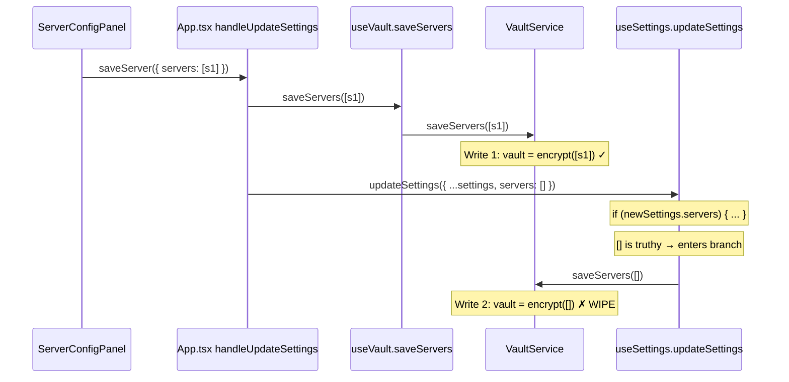

# Vault Server Persistence Audit — 2026-02-27

## 1. Provenance

| Field | Value |
|-------|-------|
| Git Hash | `b7aef75bd925a4cd49018fc4afad997b46fb7fc6` |
| Dirty Status | 95 files changed, 11329+/3634− |
| Baseline (CTRL_BASELINE.md) | **Missing — Unknown State** |
| System State (CTRL_SYSTEM_STATE.md) | **Missing — Unknown State** |
| Primary Log | `console-export-2026-2-24_22-36-26.log` (144 lines) |

---

## 2. Evidence Alignment

### 2.1 User-Visible Symptom

**Servers appear saved in the UI but resolve as `NO_SERVERS` immediately after, and persist as `NO_SERVERS` after reload.**

### 2.2 Log Sequence (Primary Log, Lines 117–129)

The log captures a live occurrence of the wipe:

```
L117: [ContextMenu] Vault data changed, scheduling rebuild          ← vault_data storage.watch fires
L118: [ContextMenu] scheduleRebuild source=vault_data immediate=false
L119: [Background] Vault data changed, clearing active client cache. ← background.ts L258-263 watcher fires
L120: [ContextMenu] options changed, scheduling rebuild              ← local:options storage.watch fires (SECOND write)
L121: [ContextMenu] scheduleRebuild source=options immediate=false
L122: [ContextMenu] Absorbing trigger 'options' into pending debounce
L123: Background: Stopping Fast Polling (Idle)
L124: [ContextMenu] doRebuild() started (source=vault_data)
L125: [ContextMenu] Resolver snapshot: state=NO_SERVERS servers=0    ← WIPE CONFIRMED
L126: [ContextMenu] Effective state=NO_SERVERS servers=0 mode=1
L127: [ContextMenu] Determined 1 items for state=NO_SERVERS
L128: [ContextMenu] removeAll completed, creating menu items
L129: [ContextMenu] Menu rebuild complete — 1 items created
```

**Key observation:** L117 (vault_data change) and L120 (options change) fire in rapid succession. This is the dual-write fingerprint of `handleUpdateSettings` in `App.tsx`.

The second vault_data change (L135–143) repeats the same `NO_SERVERS` result, confirming the wipe is durable, not transient.

### 2.3 Contrast with Healthy State (Same Log, Lines 1–20)

```
L9:  [ContextMenu] Resolver snapshot: state=OK servers=1   ← servers present at startup
L16: [ContextMenu] Resolver snapshot: state=OK servers=1   ← confirmed on pending rebuild
```

Servers were intact at startup. The wipe occurred mid-session after a settings save.

---

## 3. Findings

### Finding 1: Double-Write Wipe in `handleUpdateSettings` — **ROOT CAUSE**

**File:** [App.tsx](file:///mnt/e/CTRL/extension/src/entrypoints/options/App.tsx) L38–53

```typescript
// App.tsx L38-53 (SecureContent.handleUpdateSettings)
const handleUpdateSettings = async (newSettings: AppSettings) => {
    if (!newSettings) return;

    const newServers = newSettings.servers || [];
    const oldServers = vaultServers || [];

    if (JSON.stringify(newServers) !== JSON.stringify(oldServers)) {
        await saveServers(newServers);                          // WRITE 1: correct servers → vault
    }

    await updateSettings({ ...newSettings, servers: [] });      // WRITE 2: servers: [] → useSettings
};
```

**The wipe mechanism:** Write 2 calls `useSettings.updateSettings` with `servers: []`.

**File:** [useSettings.ts](file:///mnt/e/CTRL/extension/src/features/torrent-control/model/useSettings.ts) L138–164

```typescript
// useSettings.ts L138-155
const updateSettings = async (newSettings: AppOptions) => {
    if (newSettings.servers) {                                    // [] is truthy!
        try {
            if (!await VaultService.isInitialized()) { throw ... }
            if (await VaultService.isLocked()) { throw ... }
            await VaultService.saveServers(newSettings.servers);  // OVERWRITES VAULT WITH []
        } catch (e) { ... throw e; }
    }
    ...
    const { servers, ...safeSettings } = newSettings;
    await settingsStorage.setValue(safeSettings as AppOptions);   // Writes to local:options
};
```

**The truthiness bug:** `newSettings.servers` is `[]` (an empty array). In JavaScript, `[]` is **truthy**. The guard `if (newSettings.servers)` passes. `VaultService.saveServers([])` overwrites the vault with zero servers.

**Causal chain:**
1. Any UI operation that calls `handleUpdateSettings` (save server, remove server, set default, any settings change from Dashboard)
2. Write 1 (`saveServers`) correctly persists servers to vault
3. Write 2 (`updateSettings({ ...newSettings, servers: [] })`) immediately overwrites vault with `[]`
4. Both `storage.watch(VAULT_DATA_KEY)` watchers fire (ContextMenuService L50, background.ts L258)
5. `ServerResolver.resolve()` reads an empty vault → returns `NO_SERVERS`
6. Context menus degrade to "Open CTRL to configure servers"

### Finding 2: All `VaultService.saveServers()` Callsites — **CONFIRMED BEHAVIOR**

| # | File | Line | Trigger | Can pass `[]`? |
|---|------|------|---------|----------------|
| 1 | [useSettings.ts](file:///mnt/e/CTRL/extension/src/features/torrent-control/model/useSettings.ts) | L148 | `updateSettings()` | **YES — via `servers: []` from `handleUpdateSettings`** |
| 2 | [useSettings.ts](file:///mnt/e/CTRL/extension/src/features/torrent-control/model/useSettings.ts) | L350 | `importBackup()` — atomic commit | No (guarded by `serversToImport.length > 0` at L349) |
| 3 | [useSettings.ts](file:///mnt/e/CTRL/extension/src/features/torrent-control/model/useSettings.ts) | L382 | `importBackup()` — rollback | Potentially (snapshot could be `[]`) |
| 4 | [useVault.ts](file:///mnt/e/CTRL/extension/src/features/torrent-control/model/useVault.ts) | L70 | `saveServers()` (from VaultGuard) | No (only called from Write 1) |

**Callsite #1 is the only path that can be triggered during normal settings operations.**

### Finding 3: Direct Writes to `VAULT_DATA_KEY` (`local:vaultData`) — **CONFIRMED BEHAVIOR**

| # | File | Line | Method |
|---|------|------|--------|
| 1 | [VaultService.ts](file:///mnt/e/CTRL/extension/src/shared/api/security/VaultService.ts) | L48 | `initialize()` — vault setup |
| 2 | [VaultService.ts](file:///mnt/e/CTRL/extension/src/shared/api/security/VaultService.ts) | L117 | `saveServers()` — encrypts & writes |

No other code writes directly to `local:vaultData`. All writes go through `VaultService`.

### Finding 4: Storage Keys and Watchers — **CONFIRMED BEHAVIOR**

| Key | Purpose | Watchers |
|-----|---------|----------|
| `local:vaultData` | Encrypted server configs | ContextMenuService L50, background.ts L258 |
| `local:vaultSalt` | PBKDF2 salt (vault init marker) | ContextMenuService L70 |
| `session:encryptionKey` | AES-GCM session key (JWK) | ContextMenuService L56, background.ts L246 |
| `local:session_encryptionKey` | Firefox fallback for session key | ContextMenuService L63 (Firefox only) |
| `local:options` | Global settings (non-server) | useSettings.ts L128, ContextMenuService L44, background.ts L268 |

### Finding 5: Stabilization TTL Cannot Save Against This Bug — **SYMPTOM**

`ContextMenuService.stabilizeResolution()` (L132–164) uses a 3-second TTL cache to suppress transient `NO_SERVERS`. However, the wipe is **durable**: the vault is genuinely overwritten with encrypted `[]`. The stabilization correctly falls through after TTL expiry, so `NO_SERVERS` persists permanently.

### Finding 6: Firefox Session Key Cleared on Startup — **CONFIRMED BEHAVIOR (not root cause)**

`background.ts` L27–31 clears `local:session_encryptionKey` on `onStartup`. This causes the vault to be `LOCKED` after browser restart, which is **correct session semantics**. This does NOT overwrite `local:vaultData` — servers remain encrypted but inaccessible until unlock. If the double-write wipe occurred before restart, the servers are already gone from the vault itself, so unlocking will correctly show zero servers.

---

## 4. Root Cause Summary



**Single most likely wipe/overwrite path:** `App.tsx:handleUpdateSettings` L52 passes `servers: []` to `useSettings.updateSettings`, which at L140/L148 treats `[]` as truthy and overwrites the vault.

---

## 5. Highest-Leverage Next Action

**Category:** Fix root cause

**Action:** In `useSettings.updateSettings` (L138–164), change the guard from `if (newSettings.servers)` to `if (newSettings.servers && newSettings.servers.length > 0)`, **or** strip `servers` from the payload in `handleUpdateSettings` before calling `updateSettings` so servers never reach `useSettings.updateSettings` at all.

The latter approach (strip before calling) is safer because it enforces that only `useVault.saveServers` is authorized to write servers, maintaining a single writer to the vault.

---

## 6. Execution Prompt for Implementation Agent

> ### Objective
>
> Prevent `useSettings.updateSettings()` from overwriting the vault with an empty server array when called with `servers: []`.
>
> ### Root Cause Reference
>
> [App.tsx](file:///mnt/e/CTRL/extension/src/entrypoints/options/App.tsx) L52 calls `updateSettings({ ...newSettings, servers: [] })` which reaches [useSettings.ts](file:///mnt/e/CTRL/extension/src/features/torrent-control/model/useSettings.ts) L140 where `if (newSettings.servers)` evaluates `[]` as truthy and calls `VaultService.saveServers([])` at L148.
>
> ### Fix
>
> In [useSettings.ts](file:///mnt/e/CTRL/extension/src/features/torrent-control/model/useSettings.ts) `updateSettings()` (L138), change the server-save guard to:
>
> ```diff
> -    if (newSettings.servers) {
> +    if (newSettings.servers && newSettings.servers.length > 0) {
> ```
>
> This ensures an empty array never triggers a vault overwrite, while still allowing legitimate server updates (add, edit, remove-to-N≥1) to persist.
>
> ### Scope Boundary (explicit allowlist)
>
> - **MODIFY:** `extension/src/features/torrent-control/model/useSettings.ts` (single line change at L140)
>
> ### Explicitly Forbidden
>
> - Do NOT modify `manifest.json`, CSP, permissions, or any other file
> - Do NOT refactor, rename, or restructure any functions
> - Do NOT modify `VaultService.ts`, `ServerResolver.ts`, `App.tsx`, `background.ts`, or any adapter
> - Do NOT change architecture or add new files
>
> ### Regression Check
>
> - Verify `useSettings.updateSettings({ servers: [] })` does NOT call `VaultService.saveServers`
> - Verify `useSettings.updateSettings({ servers: [validServer] })` DOES call `VaultService.saveServers` with that server
> - If unit tests exist in scope, run them; otherwise explicitly state: "Unit tests not executed — manual verification required"
>
> ### Required Output
>
> Produce a Markdown report with:
> - File path and line references for the change
> - Before/after code diff
> - Evidence that the fix addresses the root cause (reference audit report `reports/2026-02-27__vault_server_persistence_overnight_audit.md`)
> - Regression check status

---

*Audit complete. Stop.*
